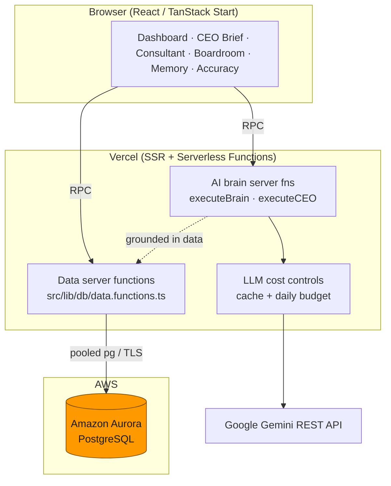

# ExecutiveOS — AWS Databases × Vercel Hackathon submission kit

Everything you need to fill out the submission form, plus the architecture and
talking points that map directly to the judging criteria.

## Track
**Track 2 — Monetizable B2B app.** ExecutiveOS is a decision-intelligence
platform: a company uploads (or connects) its operating data and gets honest,
statistically-grounded executive analysis — KPIs, a CEO brief, a strategy
consultant report, a live multi-agent AI boardroom, scenario simulation, an
executive-memory decision log with a real outcome hit-rate, and a model-accuracy
dashboard.

## AWS database used
**Amazon Aurora PostgreSQL.** It is the single source of truth for **all**
application data. Every read/write goes through Vercel serverless functions
(`src/lib/db/data.functions.ts`) that query Aurora via a pooled `pg` client
(`src/lib/db/aurora.server.ts`). `DATABASE_URL` and the SQL never reach the
browser. Schema: `db/schema.sql`.

Why Aurora PostgreSQL: the data model is relational and analytical (datasets →
rows → derived briefs/decisions, all keyed and time-ordered), Aurora gives
managed HA + read scaling + Serverless v2 autoscaling, and it pairs cleanly with
Vercel serverless. For higher concurrency, point `DATABASE_URL` at **Amazon RDS
Proxy** — no code change.

## Architecture

Key properties judges look for:
- **Deliberate data model:** normalized relational schema (`db/schema.sql`) with
  FKs + `ON DELETE CASCADE`, JSONB for flexible analytic payloads, time-ordered
  indexes per dataset. Multi-row dataset ingestion is transactional.
- **Real boundary:** the browser never touches the DB; all access is via typed,
  zod-validated Vercel server functions. `DATABASE_URL` is server-only.
- **Beyond basics on Vercel:** SSR + ~30 serverless RPC endpoints, an LLM brain
  with caching + a daily budget, graceful degradation, and an honest
  "live AI vs built-in" provenance system.

## How it maps to the judging criteria
- **Technological Implementation** — Aurora-backed relational model behind
  Vercel server functions; real statistics engine (OLS trend with R²/p-value,
  prediction intervals, backtest MAPE, HHI, anomaly detection — `statistics.ts`,
  unit-tested); data-capability gating so the app never fabricates a metric it
  can't compute.
- **Design** — front end designed against the back end: every number carries its
  provenance (data-derived / estimate / not-computable), live-AI vs built-in
  badges, a data-quality score before analysis is trusted.
- **Impact & real-world applicability** — a genuine B2B need (fast, trustworthy
  executive analysis) on production-grade infra (Aurora + Vercel); ships with
  **email/password authentication + per-account data isolation** (sessions in
  Aurora, scrypt-hashed passwords — `docs/SECURITY.md`), industry calibration,
  and an outcome feedback loop. This is account-isolated multi-tenant software,
  not an open demo.
- **Originality** — an "honesty-first" BI copilot: it quantifies only what the
  data supports, grades its own past decisions by real outcomes, and discloses
  every assumption.

## Submission checklist
- [ ] **Which AWS database:** Amazon Aurora PostgreSQL (text above).
- [ ] **Demo video (<3 min, YouTube):** see script below.
- [ ] **Published Vercel project link + Vercel Team ID** (Vercel → Settings → General).
- [ ] **Architecture diagram:** the Mermaid diagram above (or export to PNG).
- [ ] **AWS-usage screenshot:** AWS Console → RDS → your Aurora cluster, and/or
      Vercel env var `DATABASE_URL` pointing at the Aurora endpoint.
- [ ] (Bonus) Publish a build write-up with hashtag `#H0Hackathon`.

## 3-minute demo script
1. **Problem (20s):** "Teams either pay analysts or trust hallucinated AI BI.
   ExecutiveOS gives honest, data-grounded executive analysis on production infra."
2. **Sign up (10s):** create an account — show the login screen ("Secured on
   Amazon Aurora PostgreSQL"); the user + session are written to **Aurora**.
3. **Ingest (25s):** upload a CSV or **Import from URL / Google Sheet**; show the
   Data Quality score. (This writes owner-scoped rows to **Aurora**.)
3. **Decide (60s):** CEO Brief (health score + forecast with backtest error),
   Consultant report, then the **AI Boardroom** live debate; show the live-AI badge.
4. **Memory + outcomes (25s):** Executive Memory — log a decision, record its real
   outcome, show the **hit-rate** (all persisted in Aurora).
5. **The stack (30s):** architecture diagram — Vercel front end + serverless
   functions → **Amazon Aurora PostgreSQL**; show the AWS console + `DATABASE_URL`.

## Setup (also see docs/DEPLOY.md)
1. Provision Aurora PostgreSQL; get the connection string.
2. `psql "$DATABASE_URL" -f db/schema.sql`
3. Set `DATABASE_URL` + `GEMINI_API_KEY` in Vercel (and locally in `.env`).
4. `npm run build` → deploy to Vercel.
